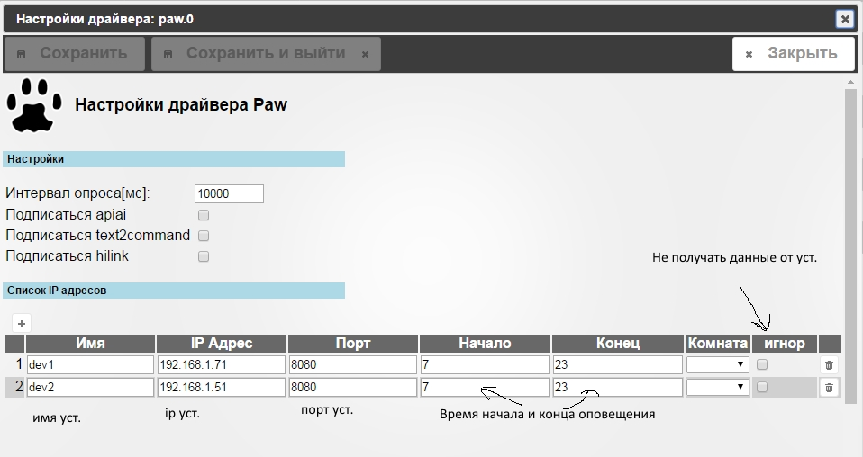

# ioBroker.paw
=================


## Установка программы и настройка драйвера.
 
Скачиваем и устанавливает приложение PAW Server for Android. 

https://play.google.com/store/apps/details?id=de.fun2code.android.pawserver 

Открываем приложение PAW Server for Android на устройстве

После инициализации нужно перенести в папку ..paw/html

файлы:


+ call_log.xhtml 
+ get.xhtml
+ set.xhtml
+ sms_read.xhtml
+ settings.xhtml

Достаточно скачать и перенести только фаил " settings.xhtml "  остальные файлы с качаются через драйвер 

и при будущих обновлениях драйвера, будут обновляться сами.

файлы брать тут https://github.com/bondrogeen/paw_json/tree/master/html.

Запускаем PAW Server for Android.

Устанавливаем драйвер iobroke.paw c GitHub.

https://github.com/bondrogeen/iobroker.paw




Для управление через vis можно управлять уст. изменяя переменную 

paw.*.[name_device].command.command 

+ lcd_on      активировать экран
+ endсall     конец связи (положить трубку)
+ scan        запустить приложение сканер штрих кода.
+ speech      активация голоса
+ restart     перезагрузка paw сервера 
+ kill        отключить paw сервер 

paw.*.[name_device].command.*

Так же и для остальных  переменных 


alert               [Внимание!],[Нет связи!!!]	    
> Предупреждения 

alertinput          [Внимание!],[введите команду]	   
> Предупреждения c запросом, ответ сохраниться в переменной  paw.*.[name_device].request.alertinput

app_start			lcf.clock	
> Запуск приложение  

call				112
> Позвонить по номеру [number]  

clipboard			Ab123	 
> Сохранить текст в буфере обмена   

dial				123456789
> Набрать номер [number] на уст.  
	
noti				Внимание , Нет ответа от уст.	
> Уведомление  [название уведомления] , [техт уведомления]  
	
openurl				http://ya.ru	
> Открыть url в браузере  

rec				1000 	
> Включить запись длительностью  [time(ms)]  

send_sms			123456789 , Проверка	
> Отправить смс сообщение на номер [number] , с текстом [text]  

vibrate		    		500
> Включить вибрацию, время в миллисекундах [time(ms)]  

volume		        [0-max]
> Установка громкости на устройстве от 0 до максимального значения,   
> максимальное значение модно посмотреть тут (обычно это 15)
> paw.*.[name_device].info.audio_volume.info.music_max 


## Команды для javascript

```javascript
/*
dev1 - имя устройства, так же можно вводить IP устройства.
Можно указывать несколько устройств через запятую 'dev1,dev3,192.168.1.71' 
all - отправить на все устройства.
*/

//Отправить текст на синтезатор речи. 
sendTo("paw.0",'dev1,dev3',{send:  'say', text:  'проверка'});

// с callback
sendTo("paw.0",'all',{
    send:  'say', 
    text:  'проверка'},function (response){
    log(JSON.stringify(response));
});

//активировать  экран на устройстве.
sendTo("paw.0",'all',{send:'lcd_on'});

//Отправка смс.
sendTo("paw.0",'dev1',{send:  'sms', text:  'проверка', number: '8123456789'});

sendTo("paw.0",'192.168.1.71',{
    send:  'sms', 
    text:  'проверка',
    number: '8123456789'
},function (response){
    log(JSON.stringify(response));
});

/*
Установка громкости от 0 до 15, максимальная громкость устанавливается системой, 
также проверяется чтобы не выходило за пределы установленных значений)
mode=    может быть (STREAM_NOTIFICATION, STREAM_MUSIC ,STREAM_ALARM, 
STREAM_RING, STREAM_SYSTEM, STREAM_VOICE_CALL)  
если не указан то по умолчанию стоит STREAM_MUSIC
*/

sendTo("paw.0",'dev1',{send:  'volume', number: '5'});

// с callback
sendTo("paw.0",'192.168.1.71',{
    send:  'volume', 
    number: '10',
    mode: 'STREAM_NOTIFICATION'
},function (response){
    log(JSON.stringify(response));
});

//Набрать номер.
sendTo("paw.0",'dev1',{send:  'call', number: '0611'});

// с callback
sendTo("paw.0",'192.168.1.71',{
    send:  'call', 
    number: '0611'
},function (response){
    log(JSON.stringify(response));
});

//Позвонить по номеру или выпоннить ussd команду.
sendTo("paw.0",'dev1',{send:  'call', number: '*100#'});

// с callback
sendTo("paw.0",'192.168.1.71',{
    send:  'call', 
    number: '0611'
},function (response){
    log(JSON.stringify(response));
});

//Включает вибрацию number (время в милисекундах)
sendTo("paw.0",'dev1',{send:  'vibrate', number: '1000'});

sendTo("paw.0",'192.168.1.71',{
    send:  'vibrate', 
    number: '100'
},function (response){
    log(JSON.stringify(response));
});

//Отправит уведомления на устройства
sendTo("paw.0",'dev1',{send:  'noti', texthead: 'Внимание',text: 'проверка'});

// с callback
sendTo("paw.0",'192.168.1.71',{
    send:  'noti',
    texthead: 'внимание',
    text: 'проверка'
},function (response){
    log(JSON.stringify(response));
});

//Отправит предупреждение на устройства
sendTo("paw.0",'dev1',{send:  'alert', texthead: 'Внимание',text: 'проверка'});


sendTo("paw.0",'192.168.1.71',{
    send:  'alert',
    texthead: 'внимание',
    text: 'проверка'
},function (response){
    log(JSON.stringify(response));
});


//Откроет браузер по указанному адресу
sendTo("paw.0",'dev1',{send:  'openurl', text: 'http://192.168.1.61:8082'});


sendTo("paw.0",'192.168.1.71',{
    send:  'openurl',
    text: 'http://ya.ru'
},function (response){
    log(JSON.stringify(response));
});

//Завершить звонок (положить трубку)
sendTo("paw.0",'dev1',{send:  'endсall'});

//Отправить  текст в буфер обмена  
sendTo("paw.0",'dev1',{send:  'clipboard',text:'текст'});


//Перезагрузка paw сервера 
sendTo("paw.0",'dev1',{send:  'server',text:'restart'});

//Остановка paw сервера
sendTo("paw.0",'dev1',{send:  'server',text:'kill'});


```


#### 0.0.1
* (bondrogeen) initial release

## License
The MIT License (MIT)

Copyright (c) 2017 bondrogeen <bondrogeen@gmail.com>

Permission is hereby granted, free of charge, to any person obtaining a copy
of this software and associated documentation files (the "Software"), to deal
in the Software without restriction, including without limitation the rights
to use, copy, modify, merge, publish, distribute, sublicense, and/or sell
copies of the Software, and to permit persons to whom the Software is
furnished to do so, subject to the following conditions:

The above copyright notice and this permission notice shall be included in
all copies or substantial portions of the Software.

THE SOFTWARE IS PROVIDED "AS IS", WITHOUT WARRANTY OF ANY KIND, EXPRESS OR
IMPLIED, INCLUDING BUT NOT LIMITED TO THE WARRANTIES OF MERCHANTABILITY,
FITNESS FOR A PARTICULAR PURPOSE AND NONINFRINGEMENT. IN NO EVENT SHALL THE
AUTHORS OR COPYRIGHT HOLDERS BE LIABLE FOR ANY CLAIM, DAMAGES OR OTHER
LIABILITY, WHETHER IN AN ACTION OF CONTRACT, TORT OR OTHERWISE, ARISING FROM,
OUT OF OR IN CONNECTION WITH THE SOFTWARE OR THE USE OR OTHER DEALINGS IN
THE SOFTWARE.
